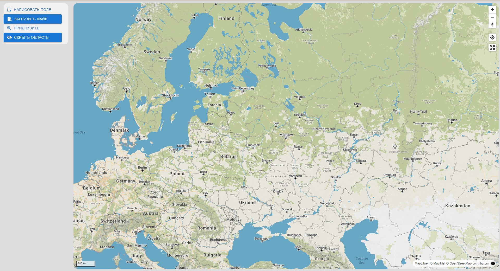
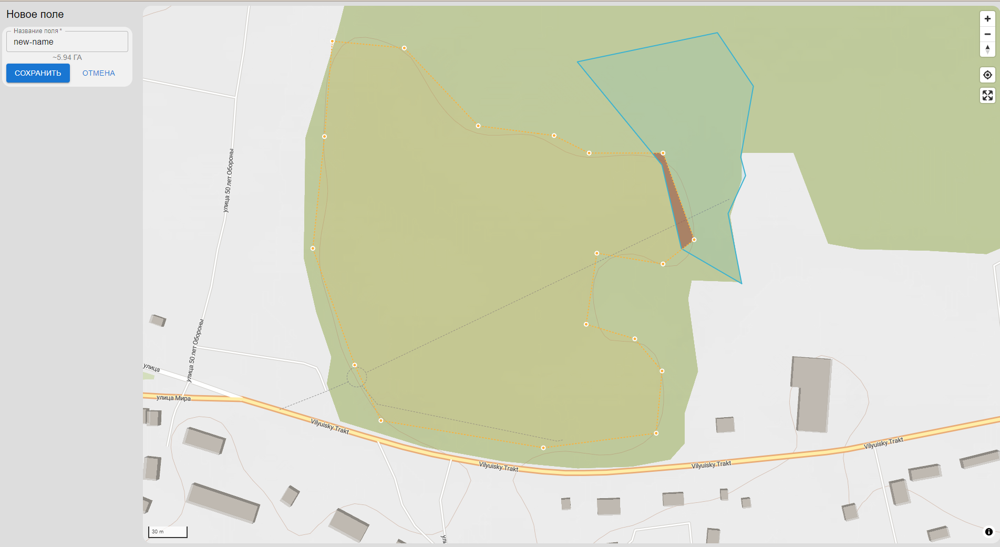
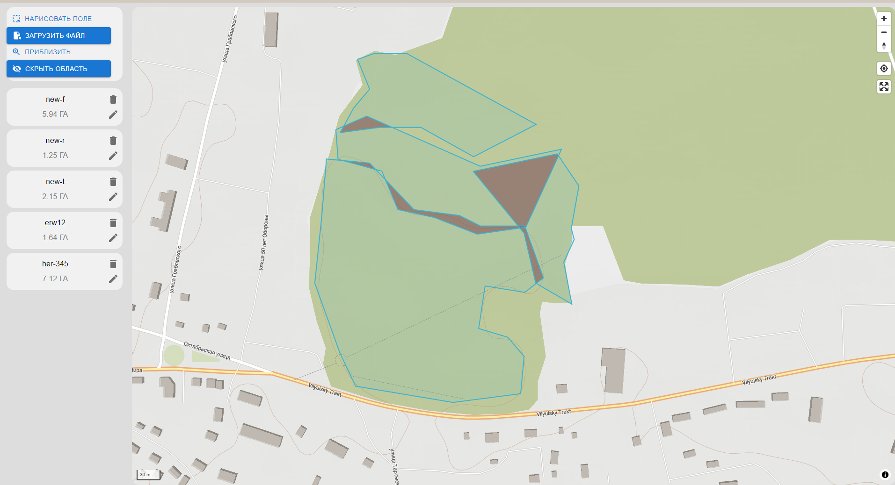

# Map-maplibre

This React component integrates a map using MapLibre GL and Mapbox GL Draw to allow users to create and manipulate polygons on a map. It provides functionalities such as drawing polygons, calculating areas, and detecting intersections between polygons.

### Features:
- **Interactive Map**: Displays a map using MapLibre GL.
- **Polygon Drawing**: Users can draw polygons on the map.
- **Area Calculation**: Automatically calculates and displays the area of drawn polygons.
- **Intersection Detection**: Identifies and displays intersections between multiple polygons.
- **Popup Information**: Shows information about polygons when clicked.

### Libraries Used:

- **React:** A JavaScript library for building user interfaces.
- **MapLibre GL:** A community-driven fork of Mapbox GL JS for rendering maps.
- **Mapbox GL Draw:** A plugin for MapLibre GL that allows users to draw and edit geometries.
- **Turf.js:** A modular geospatial analysis library for JavaScript.
- **Material-UI (MUI):** A popular React UI framework that provides components and styles for building responsive layouts.

## Usage
1. **Drawing Polygons:**
- Click on the button to create vertices of the polygon.
- Complete the polygon by clicking on the starting point or double-clicking.

2. **Viewing Area:**
- The area of the drawn polygon will be calculated and displayed automatically.

3. **Editing and Deleting:**
- Click on the card field to select it.
- Use the card field controls to delete or edit the polygon.

4. **Intersections:**
- If multiple polygons overlap, their intersection will be calculated and displayed.

5. **Popup Information:**
- Hover over on polygons to see their names and details in a popup.

### Скриншоты:

